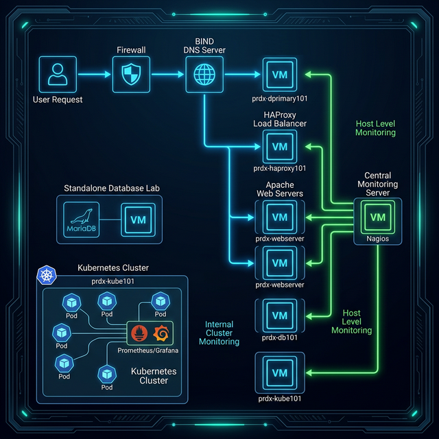

# 🚀 Enterprise DevOps Capstone Project

This project demonstrates how I designed and automated a complete enterprise-style infrastructure using DevOps tools and Infrastructure as Code.

It includes:
- Automated server provisioning using Ansible
- High availability web architecture with HAProxy
- Monitoring with Nagios
- Containerization with Docker
- Kubernetes (Kind) cluster deployment
- Modular infrastructure design

The goal of this project was to simulate a real-world production environment and practice end-to-end infrastructure automation.

---

## 🛠️ Tech Stack

- Ansible
- Docker
- Kubernetes (Kind)
- HAProxy
- Apache
- MariaDB
- Nagios
- Linux (RHEL/CentOS)

---

## 📚 Key Learnings

- Designed and deployed a multi-tier infrastructure
- Automated system configuration using Ansible playbooks
- Implemented load balancing and high availability
- Built and managed containerized workloads
- Deployed Kubernetes cluster using Kind
- Configured centralized monitoring and alerting

---

## 🎯 Project Objective

This repository contains all Ansible playbooks, configuration files, and manifests used to automate and deploy a highly available Linux-based infrastructure.

The objective of this project is to design and automate a production-like environment that simulates real-world enterprise systems using DevOps best practices.

---

## 🏗️ Global Architecture Overview

This project embodies modern DevOps methodologies, utilizing Infrastructure as Code (IaC) to configure networking, databases, high-availability web services, automated monitoring, and cutting-edge container orchestration. 



### 🖥️ Virtual Machine Inventory
The entire virtualized environment is hosted across an internally routed subnet (`10.0.0.0/24`) consisting of the following purpose-built nodes:

| Hostname | IP Address | Primary Role | Technical Stack |
|----------|------------|--------------|-----------------|
| `prdx-dprimary101` | `.239` | Internal BIND DNS Server | BIND9, Firewalld |
| `prdx-haproxy101` | `.237` | L7 TCP/HTTP Load Balancer | HAProxy, Firewalld |
| `prdx-webserver[1-3]` | `.234-.236` | Clustered Web Backends | Apache (httpd), Firewalld |
| `prdx-db101` | `.233` | **Standalone** Database Primary | MariaDB (Percona/MySQL), Firewalld |
| `prdx-kube101` | `.242` | Kubernetes (Kind) Cluster | Docker, Kind, Ingress-Nginx, Helm |
| `prdx-nagios101` | `.238` | Health Monitoring Server | Nagios Core, NRPE |

---

## 📁 Repository Structure & Modules

The repository is modularly broken down into distinct technological silos. Each folder contains its own isolated Ansible playbooks, Vagrant configurations, or Kubernetes manifests.

### 1. `dns/` (Internal Routing)
Provides the foundational BIND Domain Name Services `finalproject.local`. It configures forward and reverse zones to allow host-to-host communication via FQDN.
*   **Role**: Authority for `finalproject.local`
*   **Deployment**: 
    ```bash
    ansible-playbook dns/dns_setup.yml
    ```

### 2. `web/` (High Availability Scaling)
Deploys a traditional tiered architecture structure. It automatically configures an **HAProxy** load balancer on `prdx-haproxy101` to distribute HTTP traffic across three independent `prdx-webserver` backend nodes running **Apache**.
*   **Role**: Traffic management and HA serving.
*   **Deployment**: 
    ```bash
    ansible-playbook web/setup_webservers.yml
    ansible-playbook web/setup_haproxy.yml
    ```

### 3. `db/` (Standalone Database Lab)
Houses the automation to provision a secure MariaDB instance on `prdx-db101`. 
> [!IMPORTANT]
> This database node is a **standalone component** designed for isolated database administration practice. It does **not** have a direct data connection to the web tier or Kubernetes cluster in this architecture.
*   **Role**: Independent relational data persistence lab.
*   **Deployment**: 
    ```bash
    ansible-playbook db/setup_db.yml
    ```

### 4. `monitoring/` (Observability)
Deploys the globally centralized Nagios monitoring stack. It installs the Nagios Core engine on `prdx-nagios101` and configures NRPE (Nagios Remote Plugin Executor) on all client nodes for real-time health checks.
*   **Role**: Infrastructure-wide health monitoring and alerting.
*   **Deployment**: 
    ```bash
    ansible-playbook monitoring/setup_nagios_server.yml
    ansible-playbook monitoring/setup_nagios_clients.yml
    ```

### 5. `docker/` (Containerization)
Contains playbooks to install the Docker CE engine on target nodes and standard `Dockerfile` definitions for building custom microservice images.
*   **Role**: Container runtime provisioning.
*   **Deployment**: 
    ```bash
    ansible-playbook docker/setup_docker.yml
    ```

### 6. `kubernetes/` (Container Orchestration)
The modern, declarative microservices stack. This module spins up a `kind` local cluster and deploys a load-balanced web application alongside a full Prometheus/Grafana monitoring pipeline.
*   **Role**: Orchestrated container operations and Ingress routing.
*   **Deployment**: 
    ```bash
    ansible-playbook kubernetes/setup_kind.yml
    ```
*   🚀 **[Operational Commands](./kubernetes/KUBERNETES_GUIDE.md):** Manual manifest application and Helm stack management.
*   📚 **[The Learning Curriculum](./kubernetes/learning_materials/01_infrastructure_provisioning.md):** Educational textbook folder.

---

## ⚙️ Global Prerequisites

All configuration is managed from the `prdx-ansible101` (`.232`) Control Node. To normalize the environment (users, dependencies, timezone), run:

```bash
ansible-playbook setup_utils.yml
```

Once base systems are normalized, systematically enter each directory to execute specific silos.
