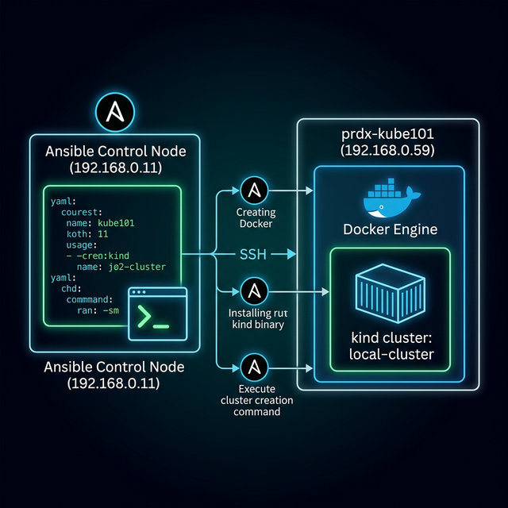

# 📘 Lesson 1: Infrastructure Provisioning Deep Dive

Welcome to the Kubernetes infrastructure curriculum! In this first lesson, we will explore exactly *how* a Kubernetes cluster is born. 

We will learn how the Ansible playbook (`setup_kind.yml`) acts as our automated builder, how the `kind` tool creates the cluster, and why configuring Docker's virtual network is the most critical networking concept to master.

---

## 🗺️ The Provisioning Architecture

Before looking at the code, let's look at the "big picture" of what happens when you press "Enter" on the Ansible control node.



1. **Ansible (The Builder):** Sitting on the `192.168.0.11` control node, Ansible logs into the target Rocky Linux Virtual Machine via SSH.
2. **The Tools:** It downloads two critical binaries: `kubectl` (your remote control for Kubernetes) and `kind` (the engine that builds the cluster).
3. **The `kind` Engine:** Ansible runs the `kind create cluster` command.
4. **Docker (The Container):** `kind` doesn't install Kubernetes directly onto the Linux Operating System. Instead, it downloads a massive Docker image and boots a container named `kind-control-plane`. *This container acts as a simulated, virtual server*. Kubernetes runs entirely inside this isolated box.

---

## 🧑‍🏫 Teacher Breakdown: The Ansible Playbook (`setup_kind.yml`)

Let's look at the exact commands Ansible is running to build our environment, task by task.

### 1. Downloading the Binaries
```yaml
    - name: Download and install kubectl
      ansible.builtin.get_url:
        url: "https://dl.k8s.io/release/{{ kubectl_version }}/bin/linux/amd64/kubectl"
        dest: /usr/local/bin/kubectl
        mode: '0755'
```
* **What it does:** This task reaches out to the official Google storage buckets and downloads the `kubectl` binary. 
* **Why it's needed:** Without `kubectl`, you have no way to "talk" to the Kubernetes API. You couldn't ask it to create pods, and you couldn't check their status.
* **The Importance of `mode: '0755'`:** By default, downloaded files are just text. This Linux permission explicitly makes the file "Executable" so you can actually run it as a command.

### 2. Pushing the Configuration 
```yaml
    - name: Deploy kind cluster configuration
      ansible.builtin.copy:
        src: files/kind-config.yaml
        dest: /etc/kind/kind-config.yaml
```
* **What it does:** This pushes a tiny YAML file from your local Capstone repository straight into the target server's `/etc/kind/` folder.
* **Why it's needed:** By default, `kind` builds a highly restricted cluster. We *must* feed it a custom configuration file during creation to punch holes through the Docker network (we'll cover this in detail below).

### 3. Idempotency (The Golden Rule)
```yaml
    - name: Check if Kind cluster exists
      ansible.builtin.command: /usr/local/bin/kind get clusters
      register: kind_clusters
```
* **What it does:** Before creating the cluster, Ansible runs a command to check if "local-cluster" already exists, saving "registering" the output into a variable named `kind_clusters`.
* **Why it's needed:** Ansible must be **idempotent**. This means you should be able to run the playbook 100 times, and if the system is already built, it shouldn't crash or try to rebuild it. It checks the variable first, and only builds the cluster if it's missing!

### 4. cluster Execution
```yaml
    - name: Create Kind cluster
      ansible.builtin.command: /usr/local/bin/kind create cluster --name local-cluster --config /etc/kind/kind-config.yaml
      when: "'local-cluster' not in kind_clusters.stdout"
```
* **What it does:** This is the magic command. It tells the `kind` engine to boot the Docker container, install Kubernetes inside it, and name it `local-cluster`. Note the `--config` flag where we pass in the file we pushed in Step 2!

---

## 🧱 The Network Wall: Understanding `kind-config.yaml`

If you take away one concept from this lesson, it should be this: **Docker containers are completely, 100% isolated from the outside network.**

If you run a web server inside a Docker container, you cannot access it from your browser unless you explicitly map a port through Docker's virtual firewall.

This is what `kubernetes/files/kind-config.yaml` achieves:

```yaml
kind: Cluster
apiVersion: kind.x-k8s.io/v1alpha4
nodes:
- role: control-plane
  extraPortMappings:
  - containerPort: 80
    hostPort: 80
    protocol: TCP
  - containerPort: 443
    hostPort: 443
    protocol: TCP
```

### The `extraPortMappings` Concept
Imagine your Rocky Linux Virtual Machine (192.168.0.59) is a giant concrete bunker, and the `kind` Docker container is a tiny glass box inside of it.

1. **`containerPort: 80`**: A single open pipe into the NGINX Ingress Controller waiting inside the cluster.
2. **`containerPort: 443`**: A separate pipe for future HTTPS traffic.

If a user tries to browse to `http://app.project.local`, the DNS server resolves that name to the VM's IP (192.168.0.59). The traffic then hits the outside wall of the concrete bunker and would normally stop cold.

By writing `hostPort: 80` directly beneath `containerPort: 80`, you are forcing Docker to drill a physical pipe through the concrete bunker wall all the way into the glass box. All web traffic — for every app — flows through this single pipe into the NGINX Ingress Controller. The Controller then reads the `Host:` header (`app.project.local` vs `headlamp.project.local`) and routes internally to the correct Kubernetes service.

This is why only two ports are needed, no matter how many applications you deploy!

---
**Next Step:** Now that you understand how the cluster infrastructure is built, proceed to [Lesson 2: Kubernetes Architecture](./02_kubernetes_architecture.md) to understand how traffic flows *inside* the cluster.
