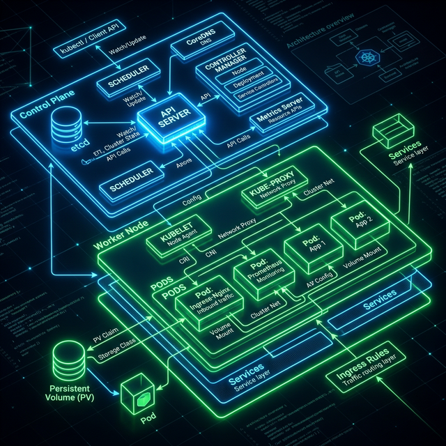

# ☸️ Lesson 2: Kubernetes Architectural Flow

This document provides a deep dive into the Kubernetes architecture designed for this Capstone project. It explains the journey of traffic from an external browser, through the Virtual Machine, into the isolated Docker ecosystem, and finally to the load-balanced application pods.

---

## 🏗️ The 10,000-Foot View (Infographic)

The following diagram illustrates the complete infrastructure stack, starting from your DNS Server resolving the hostname, down to the `kind` cluster running inside the `prdx-kube101` VM.

---

## 📖 Section-by-Section Breakdown

### 1. The Virtual Machine & Docker Bridge
As established in **Lesson 1**, Kubernetes (via `kind`) does not run directly on the Linux Host OS. It boots a massive Docker container. 

We used the `kind-config.yaml` file's `extraPortMappings` to force Docker to drill a pipe through its isolated firewall. This means any traffic that hits the Virtual Machine's IP address (192.168.0.59) on Port 80 is instantly piped directly into the `kind` Docker container on Port 80.

*But what happens once the traffic crosses that bridge and is officially inside the Kubernetes cluster?*

### 2. The NGINX Ingress Controller (The Traffic Cop)
Once the traffic is piped inside the cluster on Port 80, it hits the **Ingress Controller**.

Think of the Ingress Controller as a highly intelligent traffic cop standing at the cluster's single front door. It reads the HTTP `Host:` header on every incoming packet — the hostname your DNS server resolved.
* A request for `app.project.local` gets routed to the Lab App Service.
* A request for `headlamp.project.local` gets routed to the Headlamp Dashboard Service.
* A request for `grafana.project.local` gets routed to the Grafana Service in the `monitoring` namespace.

This is **host-based routing** — the production-grade pattern used by every cloud provider. A single Ingress Controller on Port 80 handles an unlimited number of applications by inspecting the hostname, completely eliminating the need for per-app NodePorts.

### 3. The Kubernetes Service (The Load Balancer)
Pods (which hold your actual application containers) are ephemeral. They crash, they get deleted, and their IP addresses change constantly. It is impossible for the Ingress Controller to reliably keep track of them individually.

* **The Solution (`lab-app-service.yaml`):** The `ClusterIP` Service acts as a permanent, unchanging virtual IP address inside the cluster. The Ingress Controller always sends traffic to this Service. 
* **Load Balancing:** The Service uses a `Selector` (e.g., `app=lab-app`) to continuously discover all currently healthy Pods. When a request arrives, the Service load-balances it (using Round-Robin) across the available Pods.

### 4. The Deployment (The Application Pods)
The Deployment (`lab-app-deployment.yaml`) is the boss that manages your actual web application code.
* You requested `replicas: 2`, so the Deployment ensures exactly 2 identical Pods are running at all times.
* **Proving Load Balancing:** To visually prove the traffic is being distributed, the Deployment utilizes an `initContainer`. Right before the NGINX web server starts, this init container grabs the Pod's unique identifier and explicitly writes it to the `index.html` file so you can see exactly which pod served your web request.
* We configured `Resource Limits` to ensure these pods can never consume more than 256MB of RAM, protecting the cluster from crashing if the application malfunctions.

---
**Next Step:** Proceed to [Lesson 3: Manifests Deep Dive](./03_manifests_deep_dive.md) to understand the exact YAML code required to build the Routing, Service, and Deployment components.
