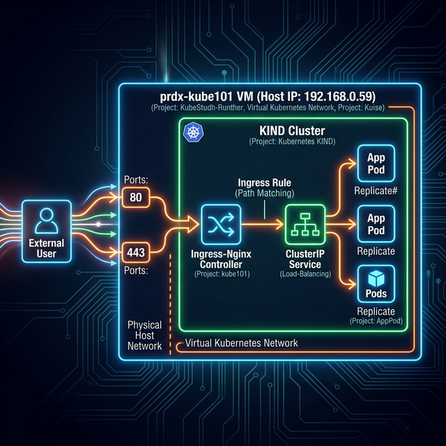

# 🔬 Lesson 3: Manifests Deep Dive

This document provides a highly detailed, line-by-line explanation of the three Kubernetes manifests used to deploy the Lab Application. It is designed to act as a study guide for understanding the actual YAML syntax that configures the architectural concepts we learned in Lesson 2.

---

## 🗺️ Application Traffic Flow (Infographic)

The following diagram illustrates exactly how external network traffic flows through the Kubernetes components defined in these manifests to reach your application.



---

## 1. The Deployment (`lab-app-deployment.yaml`)

The Deployment is the "boss" that ensures your application containers are running, healthy, and scaled to the correct number.

```yaml
 1: apiVersion: apps/v1
 2: kind: Deployment
```

- **Lines 1-2**: Specifies the Kubernetes API version to use and declares that this file describes a `Deployment` object.

```yaml
 3: metadata:
 4:   name: lab-app-deployment
 5:   labels:
 6:     app: lab-app
```

- **Line 3**: Begins the `metadata` block, which contains identifying information about the Deployment itself.
- **Line 4**: Names the Deployment `lab-app-deployment`. This is the name you see when you run `kubectl get deployments`.
- **Lines 5-6**: Attaches a conceptual "sticky note" (label) to the Deployment saying `app=lab-app`.

```yaml
 7: spec:
 8:   replicas: 2
```

- **Line 7**: Begins the `spec` (specification) block. This defines the _desired state_ of the Deployment.
- **Line 8**: Tells Kubernetes: _"I want exactly 2 identical copies (pods) of this application running at all times."_

```yaml
 9:   selector:
10:     matchLabels:
11:       app: lab-app
```

- **Lines 9-11**: This tells the Deployment boss _how_ to find the pods it is supposed to manage. It states: _"You are responsible for any pod that has the label `app: lab-app` attached to it."_

```yaml
12:   template:
13:     metadata:
14:       labels:
15:         app: lab-app
```

- **Line 12**: Begins the `template` block. This is the exact blueprint used every time the Deployment creates a new Pod.
- **Lines 13-15**: Ensures that every single Pod created from this blueprint automatically gets the `app: lab-app` label attached to it (so the boss can find it using the `selector` defined above).

```yaml
16:     spec:
17:       volumes:
18:       - name: web-content
19:         emptyDir: {}
```

- **Line 16**: Begins the Pod's blueprint specification.
- **Lines 17-19**: Creates a temporary, empty virtual hard drive (`emptyDir`) named `web-content` that lives as long as the Pod lives.

```yaml
20:       initContainers:
21:       - name: init-html
22:         image: busybox
23:         command: ['sh', '-c', 'echo "<h1>Served by: ${HOSTNAME}</h1>" > /web/index.html']
24:         volumeMounts:
25:         - name: web-content
26:           mountPath: /web
```

- **Lines 20-22**: Defines an `initContainer` named `init-html` using a tiny Linux image called `busybox`. InitContainers must successfully finish running _before_ the main app starts.
- **Line 23**: The command the container runs. It grabs the unique Pod ID (`${HOSTNAME}`) and writes it into a file called `index.html`.
- **Lines 24-26**: Plugs the empty `web-content` virtual hard drive into the initContainer at the folder path `/web`. This allows it to save the `index.html` file to the shared drive.

```yaml
27:       containers:
28:       - name: lab-app-container
29:         image: nginxinc/nginx-unprivileged:alpine
```

- **Lines 27-29**: Defines the main application container running the secure, unprivileged NGINX web server.

```yaml
30:         ports:
31:         - containerPort: 8080
```

- **Lines 30-31**: Declares that this NGINX container is programmed to listen for web traffic on port `8080`.

```yaml
32:         volumeMounts:
33:         - name: web-content
34:           mountPath: /usr/share/nginx/html
```

- **Lines 32-34**: Plugs that exact same `web-content` virtual hard drive into the NGINX container right where NGINX looks for website files. Because the initContainer already wrote `index.html` here, NGINX immediately serves it!

```yaml
35:         resources:
36:           requests:
37:             cpu: "100m"
38:             memory: "128Mi"
39:           limits:
40:             cpu: "250m"
41:             memory: "256Mi"
```

- **Lines 35-41**: Establishes Guardrails. `requests` guarantees the container will be given at least 0.1 CPU cores and 128MB of RAM. `limits` acts as a hard ceiling, automatically killing the container if it tries to consume more than 256MB of RAM to protect the rest of the cluster.

---

## 2. The Service (`lab-app-service.yaml`)

As discussed in Lesson 2, the **Service** provides the permanent, unchanging virtual IP address that sits in front of the ephemeral application Pods. Here is how that is configured:

```yaml
1: apiVersion: v1
2: kind: Service
3: metadata:
4:   name: lab-app-service
```

- **Lines 1-4**: Declares a standard Kubernetes `Service` and names it `lab-app-service`. The Ingress Controller will look for this exact name.

```yaml
5: spec:
6:   type: ClusterIP
```

- **Lines 5-6**: Defines the service behavior. `ClusterIP` means this service will only be accessible from _inside_ the Kubernetes cluster network. It doesn't expose anything directly to the internet.

```yaml
7:   selector:
8:     app: lab-app
```

- **Lines 7-8**: This is how the Service knows where to forward traffic. It scans the entire cluster looking for any pod with the `app: lab-app` label. If it finds 2 pods with that label, it automatically splits the traffic 50/50 between them.

```yaml
9:   ports:
10:     - protocol: TCP
11:       port: 80
12:       targetPort: 8080
```

- **Lines 9-12**: The actual traffic mapping. It tells the Service: _"Listen for traffic arriving on Service Port **80**, and when you receive it, forward it to the Pods on their **8080** Port"._

---

## 3. The Ingress (`lab-app-ingress.yaml`)

The **Ingress Controller** acts as our smart traffic router. This manifest forms the actual rulebook detailing where the Controller should send incoming website visitors.

```yaml
1: apiVersion: networking.k8s.io/v1
2: kind: Ingress
3: metadata:
4:   name: lab-app-ingress
```

- **Lines 1-4**: Declares a standard `Ingress` rule object and names it `lab-app-ingress`.

```yaml
5:   annotations:
6:     nginx.ingress.kubernetes.io/rewrite-target: /
```

- **Lines 5-6**: `Annotations` are custom instructions meant for specific controllers. This annotation is meant specifically for the NGINX controller, ensuring the URL paths are structured correctly before being sent to the backend.

```yaml
7: spec:
8:   rules:
9:   - http:
```

- **Lines 7-9**: This is where we define the **Host-Based Routing** rule. By specifying `host: app.project.local`, we tell the Ingress Controller to ONLY trigger this rule if the incoming request matches this exact domain name.

```yaml
10:       paths:
11:       - path: /
12:         pathType: Prefix
```

- **Lines 10-12**: Tells the controller that this rule applies to _all_ URL paths starting with `/` (which means the root of the website, i.e., everything).

```yaml
13:         backend:
14:           service:
15:             name: lab-app-service
16:             port:
17:               number: 80
```

- **Lines 13-17**: The final destination! It instructs the Ingress Controller: _"If traffic matches the hostname above, forward it entirely to the `lab-app-service` on port `80`"_. From there, the Service load-balances it to the Pods.

---
**Next Step:** Proceed to [Lesson 4: The Monitoring Stack Architecture](./04_monitoring_stack.md) to learn how telemetry data is gathered from the Pods we just deployed.
