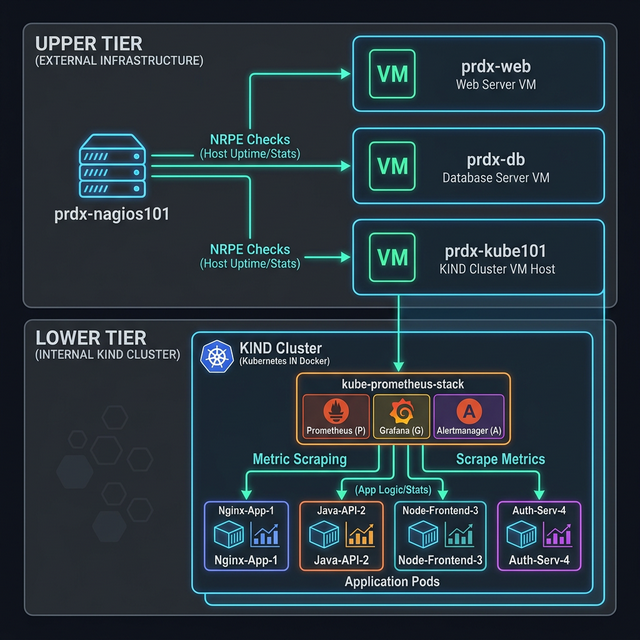

# 📊 Lesson 4: The Kubernetes Monitoring Stack

In this lesson, we will explore the `kube-prometheus-stack`, a massive open-source project that provides industry-standard monitoring, alerting, and metrics visualization for Kubernetes clusters.

We deployed this stack as an "added bonus" to your environment to give you a real-world look at how engineers monitor cluster health.

---

## 🗺️ The Monitoring Architecture

Take a look at the infographic below. It illustrates the different components of the stack and how telemetry flows from your Application Pods all the way to your web browser.

---

## 🏛️ Two-Tier Monitoring Strategy

In this project, we utilize a **Two-Tier Monitoring** strategy to ensure full visibility into both the physical infrastructure and the virtual applications.

### Tier 1: External Host Monitoring (Nagios)
The **Nagios** server (`192.168.0.58`) sits outside the Kubernetes cluster. Its job is to monitor the **Host Operating Systems**. 
- It uses **NRPE** to check the health of the `prdx-kube101` VM itself (CPU, Disk Space, Memory).
- **Crucial Note:** Nagios does not look inside the Kubernetes cluster. It only cares if the VM is up and the Docker engine is running.

### Tier 2: Internal Cluster Monitoring (Prometheus)
The **Prometheus** stack lives inside the cluster. Its job is to monitor the **Pods and Services**.
- It polls the internal Kubernetes metrics APIs.
- It provides deep insight into container performance that Nagios cannot see.

By separating these tiers, we ensure that even if the Kubernetes cluster crashes, Nagios will still alert us that the VM is alive but the service is down!

---

## 📖 Component Breakdown
Everything inside Kubernetes (including the Node itself, the Ingress Controller, and your Lab Application Pods) generates raw text metrics. These metrics include current CPU usage, RAM utilization, and network traffic volume.

### 2. The Engine: Prometheus
**Prometheus** is a Time-Series Database and "Scraping" engine. 

Notice that the Application Pods do not actively *push* their metrics anywhere. Instead, Prometheus is configured with ServiceMonitors. Every 15 to 30 seconds, Prometheus actively reaches out to every single pod in the cluster, scrapes the raw text metrics, and stores them in its massive internal database, attaching a timestamp to every single data point.

### 3. The Visualization: Grafana
Looking at millions of rows of text data in a Prometheus database is impossible for a human. 

**Grafana** is a specialized visualization engine. It connects directly to Prometheus, runs complex mathematical queries (using a language called PromQL) against the database, and renders that data into beautiful, real-time graphs and charts.

---

## 🔌 The Access Strategy: Host-Based Ingress Routing

In **Lesson 1**, we learned how only Ports 80 and 443 are mapped through the Docker firewall. Every application — including Grafana and Prometheus — is accessible through this single pipe.

For the Monitoring Stack, rather than using temporary `kubectl port-forward` tunnels, we deploy **Ingress resources** in the `monitoring` namespace, just like we did for the Lab Application. This means:

- Browse to `http://grafana.project.local` → NGINX Ingress → Grafana Service
- Browse to `http://prometheus.project.local` → NGINX Ingress → Prometheus Service

**How the DNS + Ingress combination works:**
1. Your machine sends a DNS query for `grafana.project.local` to `prdx-dns101`.
2. The DNS server returns `192.168.0.59` (the VM IP) — the exact same IP as the Lab App.
3. Your browser sends an HTTP request to `192.168.0.59:80` with the `Host: grafana.project.local` header.
4. NGINX Ingress reads the `Host:` header and routes the request to the `kube-prometheus-stack-grafana` service inside the `monitoring` namespace.

This approach is **simpler, more permanent, and more production-like** than port-forwarding. There are no background terminal processes to maintain.

---
**Next Step:** Proceed to [Lesson 5: Zero-Config Access with nip.io](./05_wildcard_dns_nip_io.md) to learn how to access these monitoring tools more easily.
